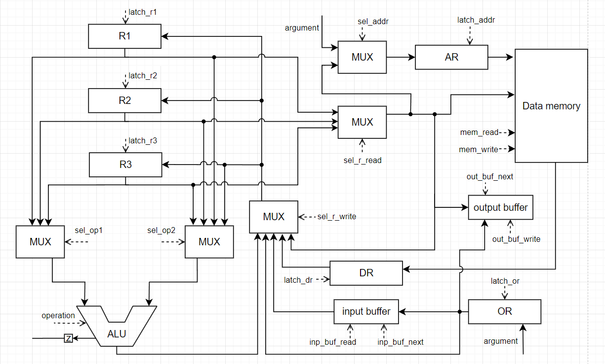

# csa-lab3-bilobram

- Билобрам Денис Андреевич, P3219
- `asm | risc | harv | mc | instr | struct | stream | port | cstr | prob1 | pipeline`
- Базовый вариант.

## Язык программирования ASM

``` bnf
<program> ::= <data_section> <text_section>

<data_section> ::= ".data" {<data_definition>}*

<data_definition> ::= <label> ":" <data_value>

<data_value> ::= <string_literal> | <number>

<string_literal> ::= <char_literal> {"," <char_literal>}*

<char_literal> ::= "'" <char> "'"

<number> ::= <digit> {<digit>}*

<text_section> ::= ".text" {<instruction>}*

<instruction> ::= <label> ":" <command> | <command>

<label> ::= <letter> {<letter> | <digit>}*

<command> ::= "MOV" <reg> "," <number>
            | "MOV" <reg> "," <reg>
            | "LOAD" <reg> "," <direct_address>
            | "LOAD" <reg> "," <indirect_address>
            | "STORE" <reg> "," <direct_address>
            | "STORE" <reg> "," <indirect_address>
            | "ADD" <reg> "," <reg> "," <reg>
            | "SUB" <reg> "," <reg> "," <reg>
            | "INC" <reg>
            | "CMP" <reg> "," <reg>
            | "JMP" <label>
            | "JNZ" <reg>
            | "HALT"
            | "OUT" <reg> "," <port>
            | "IN" <reg> "," <port>

<reg> ::= "R1" | "R2" | "R3"

<direct_address> ::= <number>

<indirect_address> ::= "(" <reg> ")"

<port> ::= <number>

<letter> ::= "a" | "b" | "c" | "d" | "e" | "f" | "g" | "h" | "i" | "j" | "k" | "l" | "m"
           | "n" | "o" | "p" | "q" | "r" | "s" | "t" | "u" | "v" | "w" | "x" | "y" | "z"
           | "A" | "B" | "C" | "D" | "E" | "F" | "G" | "H" | "I" | "J" | "K" | "L" | "M"
           | "N" | "O" | "P" | "Q" | "R" | "S" | "T" | "U" | "V" | "W" | "X" | "Y" | "Z"

<digit> ::= "0" | "1" | "2" | "3" | "4" | "5" | "6" | "7" | "8" | "9"

<char> ::= <letter> | <digit> | <special_char>

<special_char> ::= "!" | "\"" | "#" | "$" | "%" | "&" | "'" | "(" | ")" | "*" | "+" | "," | "-" | "." | "/" | ":" | ";" | "<" | "=" | ">" | "?" | "@" | "[" | "\\" | "]" | "^" | "_" | "`" | "{" | "|" | "}" | "~"
```

## Описание семантики ASM

### Стратегия вычислений

#### Последовательное выполнение
Выполнение программы происходит последовательно, команда за командой, начиная с первой инструкции в секции `.text` и продолжая до встречи команды `HALT` или другой команды управления потоком, такой как `JMP` или `JNZ`.

#### Прямой и косвенный переход
- **`JMP <label>`**: Безусловный переход к указанной метке.
- **`JNZ <label>`**: Условный переход к указанной метке, если флаг Zero не установлен.

### Области видимости

#### Глобальные данные
Все данные, объявленные в секции `.data`, имеют глобальную область видимости. Это означает, что они доступны для всех инструкций в секции `.text` на протяжении всей программы.

#### Метки
Метки, используемые в секции `.text`, определяют точки в программе, к которым можно перейти с помощью команд управления потоком. Метки имеют локальную область видимости в пределах программы, но могут быть использованы для переходов из любой точки секции `.text`.

### Виды литералов

#### Числовые литералы
- **Описание**: Целые числа, используемые для инициализации данных, адресации и арифметических операций.
- **Пример**:
  ```
  CONST_ONE: 1
  MOV R1, 1000
  ```

#### Строковые литералы
- **Описание**: Последовательности символов, хранящиеся в памяти и используемые для вывода.
- **Пример**:
  ```
  HELLO: 'H', 'e', 'l', 'l', 'o', 0
  ```

## Организация памяти

### Модель памяти процессора

#### Машинное слово
- **Память данных**: 16 бит.
- **Память инструкций**: реализованна высокоуровневой структурой данных, машинное слово не определенно.

#### Варианты адресации
- **Косвенная адресация**: Адрес указывается в регистре. Формат: `(R1)` означает, что адрес содержится в регистре `R1`.
- **Прямая адресация**: Адрес указывается непосредственно. Формат: `100` означает, что данные находятся по адресу `100`.

### Механика отображения программы и данных на процессор
```
+----------------------+
|      Registers       |
+----------------------+
| R1                   |
| R2                   |
| R3                   |
+----------------------+

+-----------------------+
|   Instruction memory  |
+-----------------------+
| 00 : program start    |
| ...                   |
| n  : HALT             |
| ...                   |
+-----------------------+

+-----------------------+
|      Data memory      |
+-----------------------+
| 00 : CONST_ONE        |
| ...                   |
| l  : variable 1       |
| l+1: variable 2       |
| ...                   |
| c  : str literal      |
| ...                   |
+-----------------------+
```

#### Виды памяти и регистров, доступные программисту
- **Регистры общего назначения**: R1, R2, R3.
- **Память данных**: Используется для хранения данных, объявленных в секции `.data` и динамических данных.


## Система комад:

#### Команда `MOV`
- **Семантика**: Перемещает данные из одного регистра в другой или из числа в регистр.
- **Пример**:
  ```MOV R1, 1000    ; R1 = 1000
  MOV R2, R1      ; R2 = R1 (то есть R2 = 1000)
  ```

#### Команда `LOAD`
- **Семантика**: Загружает данные из памяти по указанному адресу в регистр.
- **Пример**:
  ```LOAD R1, (R2)   ; R1 = память[адрес, указанный в R2]
  LOAD R3, 50     ; R3 = память[адрес 50]
  ```
#### Команда `STORE`
- **Семантика**: Сохраняет данные из регистра в память по указанному адресу.
- **Пример**:
  ```STORE R1, (R2)  ; память[адрес, указанный в R2] = R1
  STORE R3, 100   ; память[адрес 100] = R3
  ```

#### Команда `ADD`
- **Семантика**: Складывает значения из двух регистров и сохраняет результат в третий регистр.
- **Пример**:
  ```
  ADD R1, R2, R3  ; R1 = R2 + R3
  ```

#### Команда `SUB`
- **Семантика**: Вычитает значение одного регистра из другого и сохраняет результат в третий регистр.
- **Пример**:
  ```
  SUB R1, R2, R3  ; R1 = R2 - R3
  ```

#### Команда `INC`
- **Семантика**: Увеличивает значение регистра на единицу.
- **Пример**:
  ```
  INC R1          ; R1 = R1 + 1
  ```

#### Команда `CMP`
- **Семантика**: Сравнивает значения двух регистров и устанавливает флаг состояния Zero, если значения равны.
- **Пример**:
  ```
  CMP R1, R2      ; Устанавливает флаг Zero, если R1 == R2
  ```

#### Команда `JMP`
- **Семантика**: Безусловный переход к указанной метке.
- **Пример**:
  ```
  JMP START       ; Переход к метке START
  ```

#### Команда `JNZ`
- **Семантика**: Условный переход к указанной метке, если флаг Zero не установлен.
- **Пример**:
  ```
  JNZ LOOP       ; Переход к метке LOOP, если флаг Zero не установлен
  ```

#### Команда `HALT`
- **Семантика**: Останавливает выполнение программы.
- **Пример**:
  ```
  HALT            ; Остановка программы
  ```

#### Команда `OUT`
- **Семантика**: Выводит данные из регистра на указанный порт.
- **Пример**:
  ```
  OUT R1, 1       ; Вывод значения из R1 на порт 1
  ```

#### Команда `IN`
- **Семантика**: Загружает данные с указанного порта в регистр.
- **Пример**:
  ```
  IN R1, 2        ; Загрузка значения с порта 2 в R1
  ```

## Транслятор


## Модель процессора

### Control Unit


### Data Path
